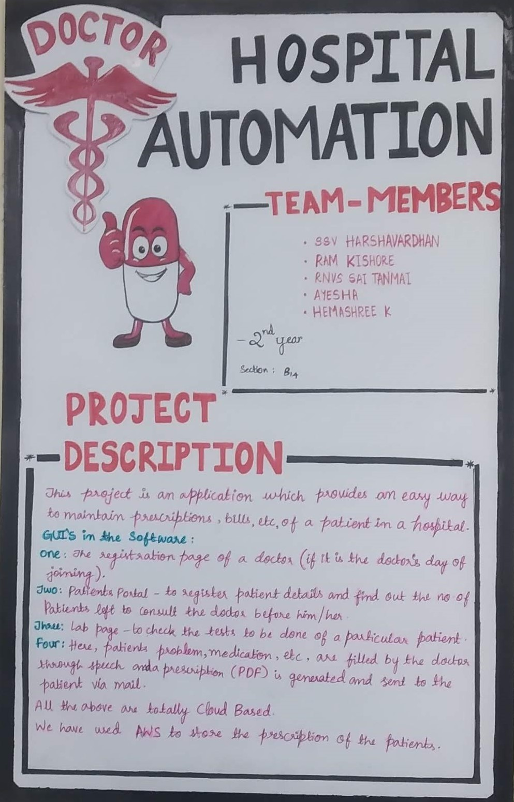
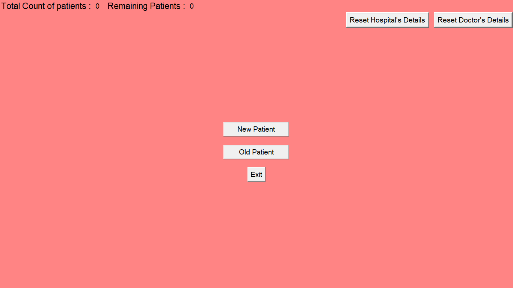
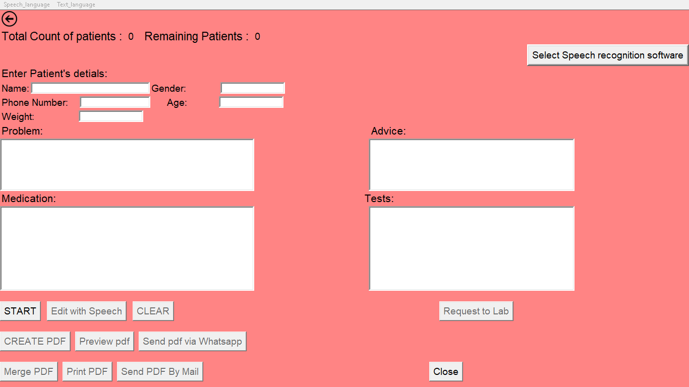

# Hospital_Automation
# Best Features:-
1.By using this app patient can see the number of patients are there before him for consulting the doctor. 
2.No need of showing prescription at the medical store, if patient tell his number then automatically pharmacists or druggist can see the medicines prescribed by the doctor. 
3.pharmacists or druggist can keep track of their medicines stock. 
4.Patients get the call and message for reminding him to take medicines. 

# Project Description

# GUI

New Patient GUI

